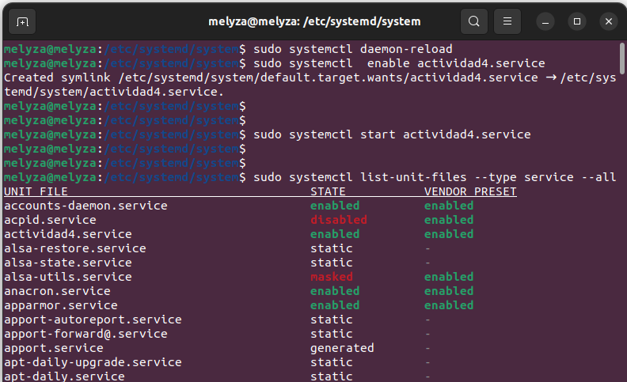
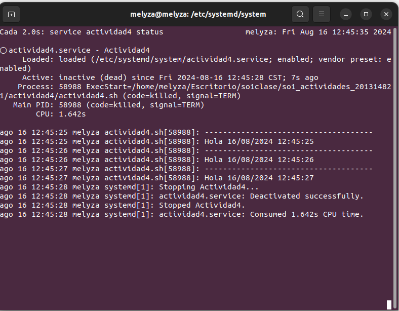

# Actividad 4

- Script de bash que imprime cada segundo un saludo y la fecha

```
#!/bin/bash
while true; do
echo "-------------------------------------"
fecha_actual=$(date +"%d/%m/%Y")
hora_actual=$(date +"%H:%M:%S")
echo "Hola $fecha_actual $hora_actual"
    sleep 1
done
```

- Archivo ***actividad4.service***
```
[Unit]
Description=Actividad4

[Service]
Type=simple
ExecStart="/home/melyza/Escritorio/so1clase/so1_actividades_201314821/actividad4/actividad4.sh"

[Install]
WantedBy=default.target
```
El archivo se encuentra alojado en el siguiente directorio

``` /etc/systemd/system```


- Comandos utilizados

Para detectar los cambios realizados, es decir, el archivo que se ha creado. 

```
sudo systemctl daemon-reload
```

Para habilitar el servicio

```
sudo systemctl enable actividad4.service
```
Para iniciar el servicio 

```
sudo systemctl start actividad3.service
```

- Verificando informaciòn de los servicios

```
sudo systemctl list-unit-files --type service --all
```




Para ver el estado del servicio 

```
watch service actividad4 status
```


Para detener el servicio 

```
sudo service actividad4 stop
```



Una vez que se ha reiniciado el sistema, podemos observar que el servicio vuelve a iniciar. 


