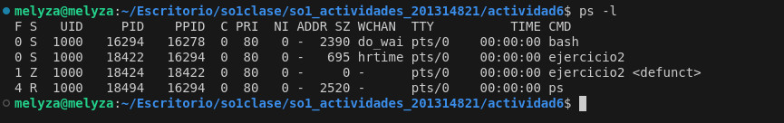

# Actividad 6 - Procesos e Hilos


- **Ejercicio 1**

  ¿Incluyendo el proceso inicial, cuantos procesos son creados por el siguiente programa? Razone su respuesta.
```
#include <stdio.h>
#include <unistd.h>

int main(){
  /* fork a child process */
  fork();

  /* fork another child process */
  fork();

  /* and fork another */
  fork();

  return 0;
}
```

|Respuesta|
|--|
|El programa crea un total de 8 hilos, esto debido a que el programa principal crea el primer proceso, seguido de este, el primer *fork* crea un segundo proceso, en total tendríamos dos.  Seguido de este, el segundo *fork* genera un proceso para cada uno de los actuales, teniendo 4. Y por último, el *fork* final genera un proceso por cada uno de los existentes. Esto nos da un total de 8 procesos en total. |

- **Ejercicio 2**

Utilizando un sistema Linux, escriba un programa en C que cree un proceso hijo (fork)que finalmente se convierta en un proceso zombie. Este proceso zombie debepermanecer en el sistema durante al menos 60 segundos. Los estados del proceso se pueden obtener del comando: ps -l

Código en *C*

```
#include <stdio.h>
#include <stdlib.h>
#include <unistd.h>
#include <sys/types.h>
#include <sys/wait.h>

int main() {
    pid_t pid = fork(); 
    if (pid < 0) {
        perror("ERROR");
        exit(1);
    } else if (pid == 0) {
        printf("HIJO PID: %d\n", getpid());
        exit(0); 
    } else {
        printf("PADRE PID: %d\n", getpid());
        printf("ZOOMBIE %d\n", pid);
        sleep(60);
        wait(NULL);
    }
    return 0;
}
```

Estado de los procesos



- **Ejercicio 3**

Usando el siguiente código como referencia, completar el programa para que sea
ejecutable y responder las siguientes preguntas:

• ¿Cuántos procesos únicos son creados?

• ¿Cuántos hilos únicos son creados?


Código en *C* 

```
#include <stdio.h>
#include <stdlib.h>
#include <unistd.h>
#include <pthread.h>

void *thread_function(void *arg) {
    printf("Hilo creado...\n");
    return NULL;
}

int main() {
    pid_t pid;
    pthread_t tid;
    pid = fork();
    printf("PID: %d\n", pid);

    if (pid == 0) {
        fork();

        if (pid == 0) {
            pthread_create(&tid, NULL, thread_function, NULL);
            pthread_join(tid, NULL);
        }
    }

    fork();

 sleep(15); 
    return 0;
}
```
