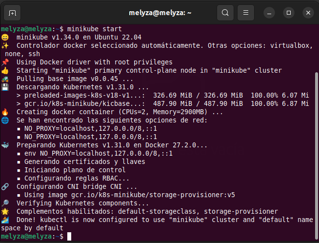
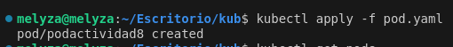
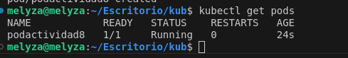
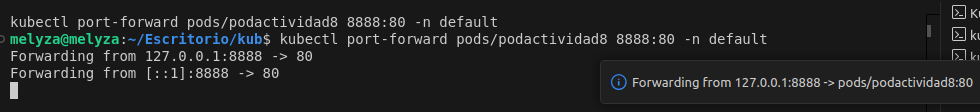
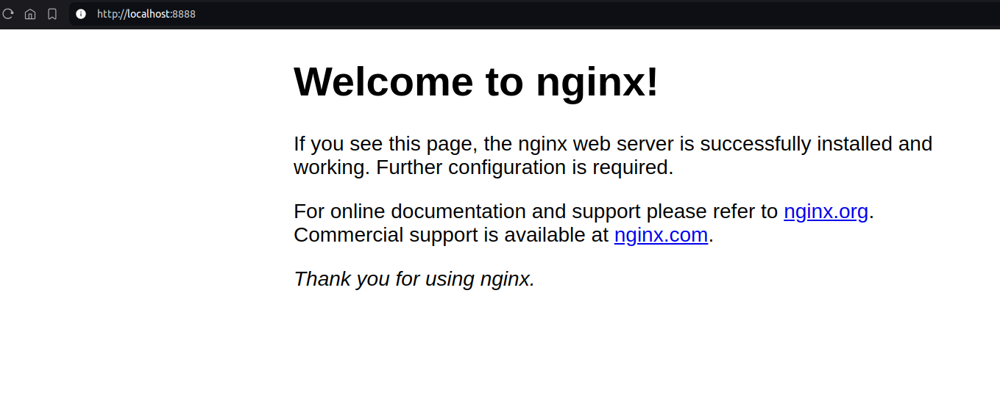

### Actividad 8
# Primeros pasos con K8s

## Instalación de *minikube* en *Ubuntu*


>
>
> Minikube es una herramienta que facilita ejecutar un clúster local de Kubernetes en una máquina personal. Está diseñado para desarrolladores que quieren probar y desplegar aplicaciones en Kubernetes sin necesidad de utilizar infraestructura en la nube. Proporciona una instalación rápida y fácil para entornos de desarrollo y pruebas.

- Instalar dependencias necesarias

```
sudo apt update
sudo apt install -y curl apt-transport-https virtualbox virtualbox-ext-pack
```

- Descargar archivo de instalación
  
```
curl -LO https://storage.googleapis.com/minikube/releases/latest/minikube-linux-amd64
```

- Instalar

```
sudo install minikube-linux-amd64 /usr/local/bin/minikube
```

- Iniciar *minikube*

```
minikube start
```




> **Nota:** Se debe tener instalado *kubectl* para poder interactuar con la herramienta *minikube*.


## Desplegar un contenedor de *nginx* en un pod 

- Para desplegar un contenedor, en este caso de *nginx*, se debe crear un archivo con extensión ***.yaml***, con la siguiente estructura 

```
apiVersion: v1
kind: Pod
metadata:
  name: podactividad8
  labels:
    app: podactividad8
spec:
  containers:
    - name: nginx
      image: nginx:1.14.2
      resources:
        requests:
          memory: "64Mi"
          cpu: "250m"
        limits:
          memory: "128Mi"
          cpu: "500m"
      ports:
        - containerPort: 80
```

- Aplicar el archivo creado con el siguiente comando

```
kubectl apply -f [ nombre del archivo ]
```




- Verificar la creación del *pod* con el siguiente comando

```
kubectl get pods
```




- Mapear el puerto a un puerto de nuestro equipo

Se debe mapear el puerto que utiliza el contenedor, en este caso es el puerto **80**, a un puerto disponible en nuestro equipo. En este caso utilizaremos el puerto **8888**.

```
kubectl port-forward pods/podactividad8 8888:80 -n default
```


- Validar funcionamiento

Para validar el funcionamiento de nuestro contenedor, debemos acceder a nuestro *localhost* en el puesto que hemos mapeado. En este caso la dirección a la que accederemos es ***http://localhost:8888***. 


